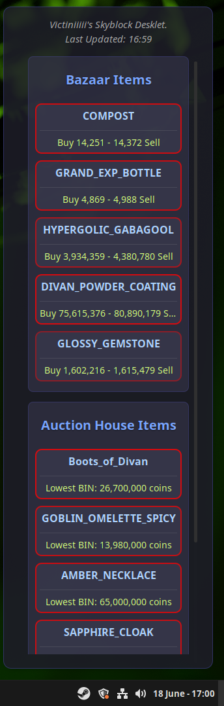
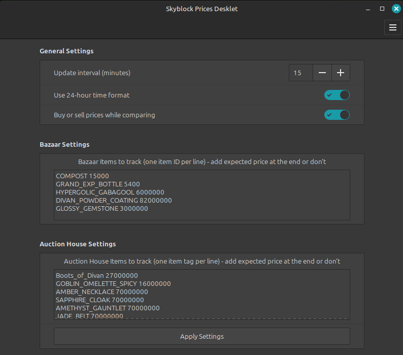

# Victiniiiii's Skyblock Desklet
## What is this app?

This is a desklet app specifically made for Linux Mint.  
Its for the usage of Hypixel Skyblock players, to catch up with the item prices while not in-game.  
If you don't know what this if for, you can think of it like as a stock market but for Skyblock players.  

## Technologies used

- Javascript for the desklet creation and customisation  
- Shell for fetching the API and printing the result data  
- CSS for styling the app  

## How to use?

jq library is needed for processing JSON files in shell files.  
First, do sudo apt install jq  
Then go to ~/.local/share/cinnamon/desklets/  
Make a folder named skyblockdesklet@Victiniiiii  
Move all the repository files, and that's it!  
The desklet will appear in Add Desklets menu.  

